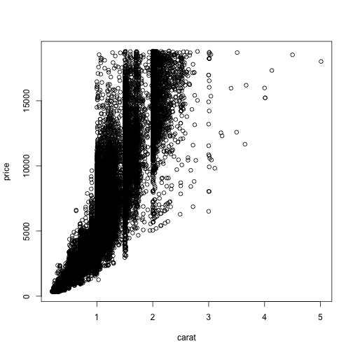

Coursera Data Products Project - Predicting the Price of a Diamond
========================================================
author: Kari Innes
date: December 5, 2014

Introduction
========================================================

This shiny app uses the diamonds data set (found in the ggplot2 R package) to predict the price of a diamond based on the following inputs:

- Carat size: weight of the diamond (0.2–5.01)
- Cut: quality of the cut (Fair, Good, Very Good, Premium, Ideal)
- Color: diamond colour, from J (worst) to D (best)
- Clarity: a measurement of how clear the diamond is (I1 (worst), SI1, SI2, VS1, VS2, VVS1, VVS2, IF (best))

The app will adjust the price each time one of the inputs is changed.

So...Why this App?
========================================================
"Diamonds are a girl's best friend" but they are also an expensive gem and most people do not understand the 4c's that impact their price.  This app allows you to enter the carat size, cut, color and clarity for your ideal diamond.  You can play around with the trade-off in the 4c's to find your ideal diamond - in your price range.

Look at the Underlying Data
========================================================


```r
library(ggplot2)
limitedDiamonds <- diamonds[,c(1:4,7)]
head(limitedDiamonds)
```

```
  carat       cut color clarity price
1  0.23     Ideal     E     SI2   326
2  0.21   Premium     E     SI1   326
3  0.23      Good     E     VS1   327
4  0.29   Premium     I     VS2   334
5  0.31      Good     J     SI2   335
6  0.24 Very Good     J    VVS2   336
```

Plot of Price based on Carat Size
========================================================

 

